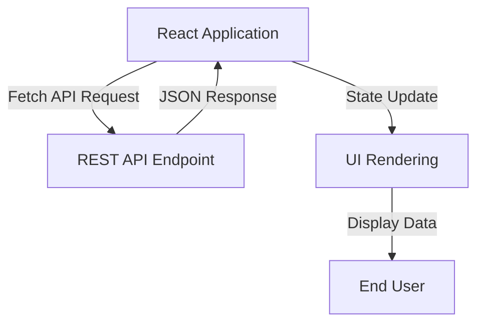

# Experiment 1: API Integration and Backend Communication

<div align="center">
  
  
  
</div>

## Project Overview

This repository contains the codebase for **API Integration**, implemented as part of the College Experiment of Full Stack 2 curriculum. The objective of this experiment is to demonstrate how to fetch and display data from a backend REST API using asynchronous calls within a React application.

## Architecture & Data Flow



## Core Components

| Component | Responsibility | Technologies Used |
|-----------|----------------|-------------------|
| `App.tsx` | Asynchronous data fetching, loading states, error handling, and UI display | React Hooks, Fetch API |
| `vite.config.ts` | Build tool configuration and plugin settings | Vite |
| `package.json` | Project dependencies and script definitions | Node.js |

## Key Features

- **Asynchronous Data Fetching**: Utilizes the built-in Fetch API to request data from external endpoints.
- **State Management**: Manages loading, error, and success states using React hooks.
- **Dynamic Rendering**: Maps over fetched data arrays to dynamically render grid components.
- **Error Handling**: Gracefully handles and displays network or processing errors.

## Getting Started

### Prerequisites
- Node.js (v16 or higher)
- npm or yarn package manager

### Installation
```bash
npm install
npm run dev
```


## Source Code (`App.tsx`)

```tsx
import { useState, useEffect } from 'react';
import './App.css';

interface Post {
  id: number;
  title: string;
  body: string;
}

function App() {
  const [posts, setPosts] = useState<Post[]>([]);
  const [loading, setLoading] = useState(true);
  const [error, setError] = useState<string | null>(null);

  useEffect(() => {
    fetch('https://jsonplaceholder.typicode.com/posts?_limit=10')
      .then((response) => {
        if (!response.ok) {
          throw new Error('Failed to fetch data');
        }
        return response.json();
      })
      .then((data) => {
        setPosts(data);
        setLoading(false);
      })
      .catch((err) => {
        setError(err.message);
        setLoading(false);
      });
  }, []);

  return (
    <div className="container">
      <header className="header">
        <h1>Experiment 1: API Integration</h1>
        <p>Fetching and displaying data from a backend REST API</p>
      </header>

      {loading && (
        <div className="status">
          <div className="spinner"></div>
          <p>Loading posts...</p>
        </div>
      )}

      {error && (
        <div className="status error">
          <p>Error: {error}</p>
        </div>
      )}

      {!loading && !error && (
        <div className="post-grid">
          {posts.map((post) => (
            <div key={post.id} className="post-card">
              <span className="post-id">Post #{post.id}</span>
              <h2>{post.title}</h2>
              <p>{post.body}</p>
            </div>
          ))}
        </div>
      )}
    </div>
  );
}

export default App;

```
